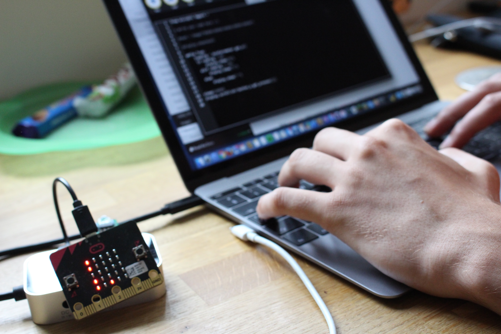

<div align="center">
  
  <h1>🚀 My Dotfiles</h1>
  <p>A carefully curated collection of my personal development environment configurations</p>
</div>

## 🚀 Installation

These dotfiles are managed using [GNU Stow](https://www.gnu.org/software/stow/), a symlink farm manager that makes it easy to maintain dotfiles.

1. First, clone this repository:

   ```bash
   git clone https://github.com/harrybaines/dotfiles.git ~/dotfiles
   cd ~/dotfiles
   ```

2. Install GNU Stow:

   ```bash
   # On Ubuntu/Debian
   sudo apt install stow

   # On macOS
   brew install stow

   # On Arch Linux
   sudo pacman -S stow
   ```

3. Use Stow to symlink configurations:

   ```bash
   # Link all configurations
   stow */

   # Or link specific configurations
   stow aerospace
   stow nvim
   ```

## 🛠️ Requirements

- GNU Stow
- Git
- Terminal emulator

## 📝 Notes

- Backup your existing configurations before installing these dotfiles
- Some configurations might need additional software to be installed
- Feel free to cherry-pick the configurations you want to use

## 📜 License

This project is licensed under the MIT License - see the [LICENSE](LICENSE) file for details.

---

<div align="center">
  <i>⭐ Star this repository if you find it helpful!</i>
</div>
